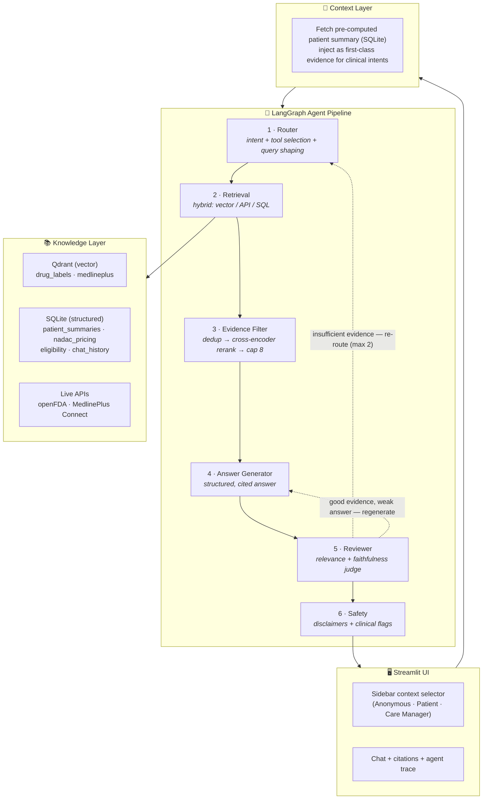
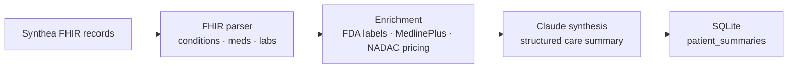

# MedDocAI — Multi-Agent Healthcare Document Intelligence

> A production-style, **source-grounded** RAG platform that answers questions about
> medications, health conditions, and Medicaid policy — with citations, safety
> disclaimers, and optional personalization to a patient's record. Built on a
> **6-agent LangGraph pipeline** with a corrective-RAG self-correction loop, hybrid
> retrieval, cross-encoder reranking, and a RAGAS evaluation harness.

<p align="left">
  <a href="https://huggingface.co/spaces/QingyunWang/MedDocAI"></a>
  
  
  
  
  
  
  <a href="https://github.com/Qingyun-Wang/MedDocAI/actions/workflows/ci.yml"></a>
  <a href="https://github.com/Qingyun-Wang/MedDocAI/actions/workflows/eval-gate.yml"></a>
</p>

**▶️ Try it live: [huggingface.co/spaces/QingyunWang/MedDocAI](https://huggingface.co/spaces/QingyunWang/MedDocAI)** — ask a real medication, condition, or Medicaid-policy question and watch the cited, source-grounded answer build. *(Free Space; the first request may take ~30s while it wakes.)*

---

## Why this project

Healthcare documents are a *harder* RAG problem than general text: FDA drug labels and
CMS policy are dense, regulated, and unforgiving of hallucination. MedDocAI tackles two
real problems with one system:

- **Patients** can't read clinical language — they need plain-language, source-grounded
  explanations of their medications, optionally tied to their own conditions.
- **Care managers** need fast, structured patient context with drug warnings
  cross-referenced against that patient's specific comorbidities.

Both are served by the **same pipeline**; the only difference is what patient context (if
any) is injected before retrieval, and which output style is used.

> ⚠️ **Synthetic data only.** All patient records are generated by [Synthea](https://synthetichealth.github.io/synthea/) — no real PHI. Answers are for demonstration and are **not medical advice**.

---

## What it does

A single chat interface where any user can ask about medications, conditions, Medicaid
policy, or drug safety. For each question the system:

1. **Routes** the query to the right tools and shapes it with patient context
2. **Retrieves** evidence across FDA labels, MedlinePlus, CMS tables, and live FDA APIs
3. **Reranks** candidates with a cross-encoder and keeps the most relevant
4. **Generates** a structured, plain-language answer with inline citation markers
5. **Reviews** every claim against the evidence — and *self-corrects* if it doesn't hold up
6. **Adds safety** disclaimers and flags clinical-decision questions

**Example queries**
- *"What should I know about metformin side effects?"*
- *"Is lisinopril safe for someone with kidney disease?"* — personalized if a patient is loaded
- *"What's the Medicaid income limit for a pregnant woman in Texas?"*
- *"Is there a current recall on my medication?"*
- *"Summarize this patient's conditions and drug interactions."* — care-manager mode

---

## Architecture



**Two routing shortcuts keep latency and cost down:**
- `patient_summary` intent **bypasses retrieval** and serves the pre-computed summary from SQLite.
- `direct_answer` intent (conversational/meta questions like *"what did I just ask?"*)
  **fast-paths straight to Answer Gen**, skipping retrieval, filtering, and review.

### The corrective-RAG loop

The Reviewer (agent 5) is not a passive checker — it's a **self-correction controller**.
It judges the draft answer on *relevance* and *faithfulness*, then:

- **Insufficient evidence** → routes back to the **Router**, which is forced to try a
  *different* query and a broader tool set (no-op retries are explicitly prevented).
- **Good evidence, weak answer** → routes back to the **Answer Generator** with feedback.
- **Hard cap of 2 retries**, then it gracefully forwards the best attempt to Safety with a
  transparency note — it never loops forever.

### Offline batch pipeline (runs once / nightly)

Patient summaries are **pre-computed**, not generated during chat — so they're served
instantly and consistently.



---

## Hybrid retrieval — the right tool per question

Not everything goes through vector search. The Router picks tools by intent:

| Question type | Tool | Why |
|---|---|---|
| Semantic ("what are the warnings for…") | **Qdrant** vector search | Meaning-based recall over label sections |
| Drug name / recall lookup | **openFDA** live API | Freshest data, no stale index |
| Pricing / eligibility / policy | **SQLite** query | Exact structured facts, not fuzzy |
| Condition / lab / procedure education | **MedlinePlus Connect** API | Plain-language, by clinical code (SNOMED/LOINC/CPT) |
| Drug education (any drug, no code) | **MedlinePlus Connect** (name fallback) | Reaches the consumer drug monograph by name |

When the frozen vector index misses a topic question, a reviewer retry can reach the **live
MedlinePlus Web Service** keyword search for current health topics — a self-healing fallback.

FDA labels are **chunked by section** (indications, warnings, contraindications, adverse
reactions, dosage) rather than fixed token windows, and tagged with `drug_name`,
`section_type`, and `ndc` for metadata-filtered search.

---

## Evaluation (RAGAS)

Quality is measured before features are added. A 30-question curated set with hand-written,
source-grounded reference answers is scored by an **independent judge** (`gpt-4o-mini` — a
different model family from the pipeline's Claude, to avoid self-grading bias).

| Metric | Baseline | After iteration | Reads |
|---|---|---|---|
| Faithfulness | 0.79 | **0.89** | Are claims grounded in retrieved evidence? |
| Answer relevancy | 0.86 | **0.86** | Does the answer address the question? |
| Context precision | 0.94 | **0.94** | Are the retrieved chunks relevant? |
| Context recall | 0.83 | **0.83** | Did retrieval capture what the reference needs? |

The high **context precision (0.94)** validates the cross-encoder reranker. More importantly,
the harness was used to **close the loop**, not just report a number — the baseline surfaced
two weaknesses, each was root-caused and fixed, then re-measured:

| Issue found | Root cause | Fix | Result |
|---|---|---|---|
| Policy faithfulness **0.29** | Answer Generator embellished one-row lookups with invented figures + ungrounded "contact your office" boilerplate | Constrain structured-lookup answers to evidence-only facts | **0.90** |
| care_mgr relevancy **0.56** | Specific clinical questions misrouted to the broad patient summary | Tighten routing: clinical questions retrieve + answer the precise ask | **0.73–0.80** |

The point of the harness is to *find* and *fix* these — diagnosis (e.g. "the answer is correct
but adds ungrounded elaboration") points to a different fix than "the answer is wrong," and the
metric guided each step. Remaining honest gaps: `care_mgr` is a small 2-question slice (noisy),
and `med_patient` context recall (~0.66) is a retrieval-coverage target for a future round.

---

## Operations — measured, gated, auto-deployed

Quality is not the only thing measured; so is what each answer costs.

**Per-query observability.** Every Claude call records latency and token usage
(previously discarded), so each query yields a cost breakdown — persisted to a
SQLite `query_metrics` table and surfaced in the UI:

```
31.2s · 3 LLM calls · 11,859 tok · $0.0451
  router             in=1606  out=169    3115ms
  answer_generator   in=3888  out=523   11454ms
  reviewer           in=5570  out=103    2363ms
  nodes: router=3362ms, retrieval=4278ms, evidence_filter=9739ms,
         answer_generator=11455ms, reviewer=2363ms, safety=1ms
```

Two things fall straight out of that: the **Reviewer is the largest input consumer**
(it re-reads all the evidence — a prime prompt-caching target), and
**`evidence_filter` costs ~9.7s with zero LLM calls** — that is the cross-encoder,
i.e. a third of the latency is local compute, not the API.

**LangSmith tracing** gives one trace per query, with nested spans per agent — the
corrective-RAG retry shows up as a second `answer_generator` span under the same
root. It is off unless a flag *and* a key are both set, so it never runs in tests,
CI, or on the public demo.

**CI/CD — three gates.**

| Workflow | Trigger | Gate |
|---|---|---|
| `ci.yml` | every push / PR | unit tests (no secrets, no torch — fast) |
| `eval-gate.yml` | PRs to `main` | **RAGAS smoke-eval; the PR fails if faithfulness/relevancy/recall/precision drop below calibrated floors** |
| `deploy.yml` | after CI passes on `main` | auto-deploy to HF Spaces (secrets-safe, LFS-preserving) |

The eval gate is **fail-closed**: a missing score, or too few rows actually scored,
fails the build rather than passing on the average of the survivors — a run where
8 of 10 questions error out must not look like a 1.0.

---

## Tech stack

| Component | Technology |
|---|---|
| LLM (generation) | Claude **Sonnet 4.5** (Anthropic) |
| Embeddings | OpenAI **text-embedding-3-small** |
| Agent orchestration | **LangGraph** |
| Vector DB | **Qdrant** (embedded for dev, server in Docker) |
| Reranker | **cross-encoder** `ms-marco-MiniLM-L-6-v2` |
| Structured data | **SQLite** |
| Frontend | **Streamlit** |
| Evaluation | **RAGAS** |
| Observability | **LangSmith** tracing + per-query token/cost/latency in SQLite |
| Deployment | **Docker Compose**, auto-deployed to HF Spaces by GitHub Actions |
| CI/CD | **GitHub Actions** — unit tests, RAGAS eval gate, auto-deploy |

---

## Quickstart

> **Just want to try it?** No setup needed — use the **[live demo on HF Spaces](https://huggingface.co/spaces/QingyunWang/MedDocAI)**. The steps below are for running it yourself.

### Run with Docker (recommended)

The whole stack — Qdrant **server** + the app — comes up with one command.

```bash
# 1. Provide API keys (copy the example and fill in)
cp .env.example .env        # set ANTHROPIC_API_KEY and OPENAI_API_KEY

# 2. Build and launch
docker compose up --build
```

On first boot the app **seeds the Qdrant server from the bundled vectors** (no
re-embedding cost) — you'll see `48,639` drug-label + `1,102` MedlinePlus points migrate.
Subsequent boots skip seeding (the `qdrant_data` volume persists).

Then open **http://localhost:8501**.

```bash
docker compose down       # stop (keeps seeded data)
docker compose down -v     # stop and wipe the Qdrant volume (forces a fresh re-seed)
```

> **How one codebase runs both ways:** a single `vector_store/client.py::get_qdrant_client()`
> factory connects to an **embedded** store locally (no server needed) or a **server** when
> `QDRANT_URL` is set (Docker sets `http://qdrant:6333`). Zero call-site branching.

### Run locally (no Docker)

```bash
python -m venv venv && source venv/bin/activate   # Windows: venv\Scripts\Activate.ps1
pip install -r requirements.txt
# .env with ANTHROPIC_API_KEY + OPENAI_API_KEY; data/ must hold the Phase-1 artifacts
streamlit run frontend/app.py
```

### Run the tests / evaluation

```bash
pytest -q                                   # 263 tests (data-dependent ones auto-skip without data/)
python evaluation/run_eval.py               # full RAGAS run (pipeline → scoring)
python evaluation/run_eval.py --skip-pipeline   # re-score cached answers only
```

---

## Project structure

```
MedDocAI/
├── ingestion/        # FHIR parser, section-aware chunker, embedding + Qdrant/SQLite load
├── agents/           # the 6 LangGraph agents + shared state
├── graph/            # LangGraph pipeline wiring (routing + corrective loop)
├── tools/            # retrieval tools (Qdrant, SQLite, openFDA, MedlinePlus)
├── vector_store/     # get_qdrant_client() factory (embedded | server by env)
├── models/           # Pydantic output schemas
├── frontend/         # Streamlit UI (context selector, citations, agent trace)
├── evaluation/       # RAGAS harness, curated 30-Q dataset, reference verifier
├── scripts/          # validation, demos, local→server vector migration
├── Dockerfile · docker-compose.yml · docker-entrypoint.sh · .dockerignore
└── tests/            # unit + integration tests
```

---

## Engineering highlights

- **Corrective-RAG loop** with retry diversification — the system fixes its own bad
  retrievals instead of returning a weak answer.
- **Retrieve-then-rerank** — a cross-encoder scores every candidate (across all sources) on
  one scale, with a graceful bi-encoder fallback if torch is unavailable.
- **Patient data as first-class evidence** — clinical facts are injected as pinned
  `Evidence` (not side-channel context), so the faithfulness checker treats them as valid
  grounding rather than ungrounded claims.
- **Section-aware chunking** of FDA labels, with metadata-filtered vector search.
- **Pre-computed patient summaries** — the offline batch layer feeds the online chat layer.
- **Honest evaluation** — an independent-judge RAGAS harness with source-verified references,
  used to *find* weaknesses, not to produce a vanity score.
- **Cost & latency instrumentation** — token usage captured at the SDK seam, priced
  per model, attributed per agent; an unpriced model reports `None`, never a fake $0.00.
- **Quality-gated CI** — a RAGAS smoke-eval blocks PRs that regress answer quality.
- **One codebase, two deployments** — env-driven Qdrant client + snapshot-migration seeding
  for a clean, reproducible container setup.

---

*Built as a flagship portfolio project demonstrating production-level LLM engineering on a
regulated, high-stakes document domain.*
